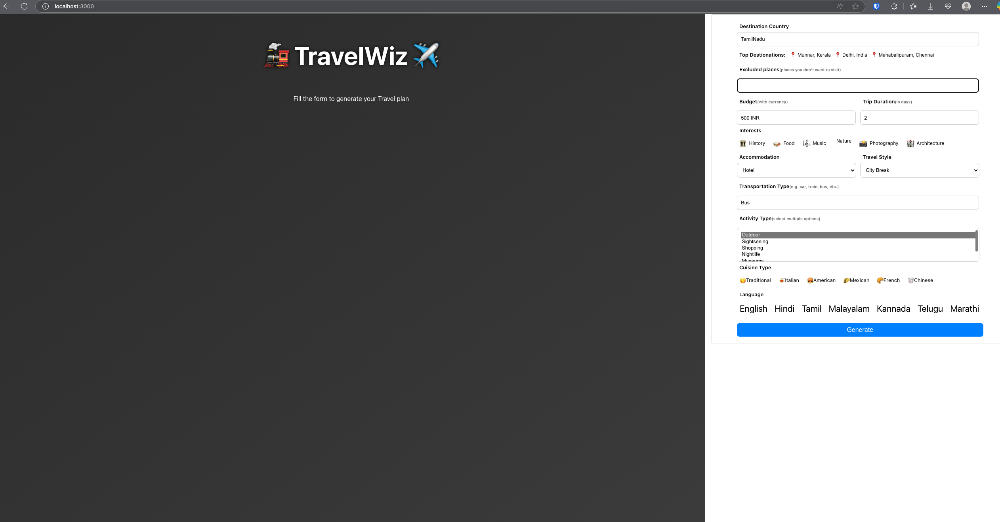

# ✈️ Travel Wiz — AI Itinerary Planner

An AI-powered travel planning web app built during Hack In Hub 2023 a hackathon by **jobs-code**, [**Kesarinath**](https://github.com/kesarinath), [**Yousuf**](https://github.com/55suhail), and [**Karthick**](https://github.com/karthicktouches). It generates smart, personalized travel itineraries using natural language input.

---

## 🌍 What It Does

- ✨ Generates multi-day travel itineraries using OpenAI  
- 🧠 Takes user input like destination, budget, duration  
- 🔁 Returns structured plans with descriptions, suggestions  
- 🛠️ Built with React, Styled-Components, and OpenAI API  
- 🧩 Altogic backend handles API calls and orchestration  

---

## ⚙️ Tech Stack

| Frontend | Backend | AI API |
|----------|---------|--------|
| React    | Altogic | OpenAI |

---

## 🖼️ UI Preview


  

---

## 📦 Setup Instructions

1. Clone the repo:  
   ```bash
   git clone https://github.com/your-username/travel-wiz.git
   cd travel-wiz
   
2. Install dependencies:

  ```bash
  Copy
  Edit
  npm install
```

3.Add your API keys:

Create a .env file with:
ini
REACT_APP_ALTOGIC_ENV_URL=your_altogic_url
REACT_APP_OPENAI_API_KEY=your_openai_key

4.Run the app:

```bash
npm start
